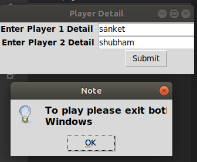
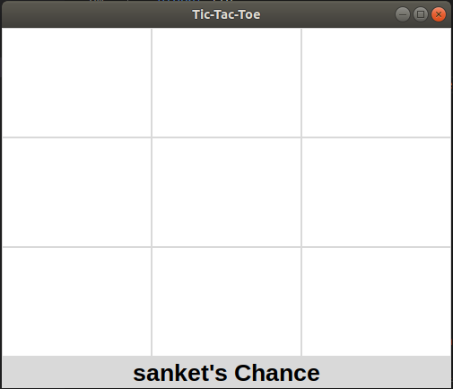
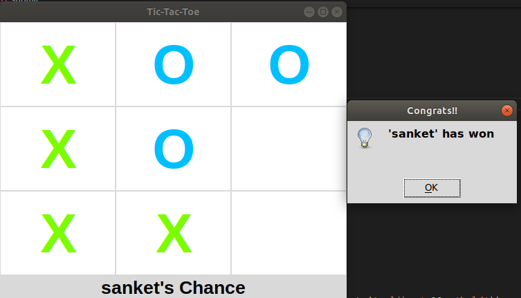

# Tic-Toc-Toe

## GUI of game

This a two player tic-toc-toe game developed using Tkinter module of python.

<h2>Game Information :-</h2> Tic-tac-toe or Xs and Os is a paper-and-pencil game for two players, X and O, who take turns marking the spaces in a 3×3 grid. The player who succeeds in placing three of their marks in a horizontal, vertical, or diagonal row is the winner
<br>

# Live Project - 
https://replit.com/@callofdutyof/Tic-Toc-Toe#main.py

# Installation :

You can download and run this code. It supports all Python supported text editors

Clone the repo. and setup python environment

```
$ git clone https://github.com/sanketmote/Tic-Toc-Toe.git
```

To run code , you need tkinter libraries to setup environment.

you can use following commands to install tkinter in linux terminal only:

```
$ sudo apt-get install python-tk -y
```
and run code
TO PLAY: Just open command Prompt or IDE or Linux terminal and run

```
python3 tictoctoe.py

```


<br>
<p>
    <h2>GUI of game</h2><br>
    <br>
    
</p>
<br>
<p>
    <h2>Winning message Image</h2><br>
    
</p>
